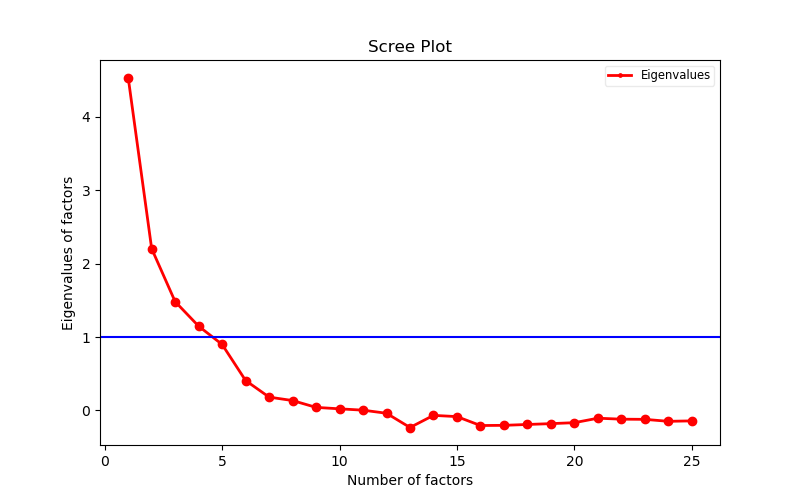
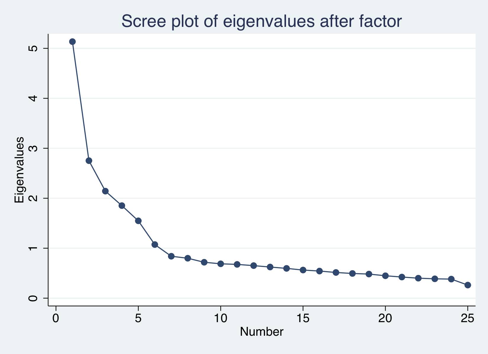

```{r setup, include=FALSE}
knitr::opts_chunk$set(echo = TRUE)
```

```{r python_engine, include = FALSE}
library(reticulate)
use_python("/usr/local/bin/python3")
```


# Introduction
Factor Analysis is a method for modeling observed variables. It is commonly used for data reduction. The key concept of Factor Analysis is that some of variables have similar patterns because they are all related to a factors (latent variables) that cannot be directly measured. The factors typically are viewed as broad concepts or ideas that may describe an observed phenomenon.

###Mathematical Models
Suppose we have a set of p observable random variables, $X_1, X_2, ..., X_p$, and they are linearly related to m latent variables (factors), $F_1, F_2, ..., F_m$, where $m<p$. They are expressed below
$$X_1 = l_{11}F_1+l_{12}F_2+ \cdots +l_{1m}F_m + \epsilon_1$$
$$X_2 = l_{21}F_1+l_{22}F_2+ \cdots +l_{2m}F_m + \epsilon_2$$
$$\vdots$$

$$X_p = l_{p1}F_1+l_{p2}F_2+ \cdots +l_{pm}F_m + \epsilon_p$$

Here $l_{ij}$ denotes the factor loading of $i^{th}$ variable on the $j^{th}$ factor. The
$\epsilon_i$ means unique error variance of $i^{th}$ variable, which cannot be explained by extracted factors.

Other assumptions are 

 + $Cov(F, \epsilon) = \mathbf{0}$.
 
 + $Cov(\epsilon_i, \epsilon_j) = 0$, where $i,j = 1,2, ..., p$.
 
 + $\mathbf{E}(F) = \mathbf{0}$.
 
 + $Cov(F) = I$.

### Work on factor analysis

+ Find the hidden factors behind observed variables: The hidden factors cannot measured directly, but can be interpretable.
+ Estimate the factor loadings.
+ Evaluate the factors we extracted.


# Factor Analysis {.tabset}

## Data

The dataset we work on is called [bfi](https://www.personality-project.org/r/html/bfi.html) from psych r-package. It consists of 2800 observations on the following 28 variables including 25 self-report personality items and three additional demographic variables (sex, education, and age). In this project, we plan to figure out the putative factors of the first 25 items in dataset.


```{r data_import, echo = TRUE, eval = TRUE, message=FALSE}
library(psych)
library(tidyverse)
library(corrplot)
mydata = bfi[1:25]
desp = describe(mydata ) %>%
  select(vars, n, mean, sd, median, min, max, range)
desp
```

```{r data_non_na, echo = TRUE, eval = TRUE, message=FALSE}
sum(complete.cases(bfi[1:25]))
```

Each item corresponds to one variable whose values are integers from 1 to 6. If we remove the cases with no missing values, there are 2436 cases, about 13% of the original ones. According to the [criteria](https://pareonline.net/getvn.asp?n=11&v=9) of sample size adequacy: sample size 50 is very poor, 100 poor, 200 fair, 300 good, 500 very good, and more than 1,000 excellent. Therefore, our sample size after removal is adequate for our purposes.


```{r data_cor, echo = TRUE, eval = TRUE, message=FALSE}
mydata = bfi[1:25][complete.cases(bfi[1:25]),]
corrplot(cor(mydata), type = "upper", tl.col = "darkblue", tl.srt = 45)
```

Based on the correlation matrix figure above, we observe several correlations are closed to 1 or -1 which means some of items are somewhat or even highly correlated. In this case, we used factor analysis to explore the structure of the relationships between variables and to determine whether these relationships can be explained by a smaller number of latent dimensions.


## R {.tabset}
### Description of R-packages

  + [psych](https://cran.r-project.org/web/packages/psych/index.html) : A package for personality, psychometric, and psychological research including ***fa***, ***fa.diagram***, ***fa.parallel*** functions for factor analysis.
  + [tidyverse](https://www.rdocumentation.org/packages/tidyverse/versions/1.2.1): A set of packages for data processing.


```{r data, echo = TRUE, eval = TRUE, message=FALSE}
library(psych)
library(tidyverse)
```


### Adequacy of Factor Analysis
There are some methods to check the adequacy of factor analysis. In this project, we adopt two of them as follow.

####1. Kaiser-Meyer-Olkin (KMO) 
[Kaiser-Meyer-Olkin](https://www.statisticshowto.datasciencecentral.com/kaiser-meyer-olkin/) (KMO) is the measure of sampling adequacy, which varies between 0 and 1. The values closed to 1.0 usually means that it is useful to process the data used by factor analysis. If the value is less than 0.50, the results of the factor analysis probably won't be very useful.
```{r test1_KMO, echo = TRUE, eval = TRUE, message=FALSE}
mydata = bfi[1:25][complete.cases(bfi[1:25]),]
KMO(mydata)
```
Based on the results of KMO above, we observe the MSA for each item is greater than 0.74 and the overall MSA is 0.85, which illustrates it is useful if we use factor analysis on the data.


####2. Bartlett's Test of Sphericity
[Bartlett's Test of Sphericity](http://shodhganga.inflibnet.ac.in/bitstream/10603/9094/10/10_chapter%208.pdf) is the test for null hypothesis that the correlation matrix has an identity matrix. The significant p-value indicates null hypothesis that all off-diagonal correlations are zero is falsified.
```{r test2_bartlett, echo = TRUE, eval = TRUE, message=FALSE}
cortest.bartlett(mydata)
```
As we can see, the p-value of this test is significant, which means some of off-diagonal correlations are nonzero. It further suggests it is necessary to go ahead with factor analysis.


### Number of Factors
There are several ways to determine the number of factors. Now, we use two ways below.
####1. Screeplot
In [screeplot](https://www.researchgate.net/publication/276934102_The_Scree_Test_and_the_Number_of_Factors_a_Dynamic_Graphics_Approach), eigenvalues of correlation matrix represent variances explained by each factor (sometimes sums of squared factor loadings are used instead). The adequate number of factors is before the sudden downward inflextion of the plot. Eigenvalues sum to the number of items, so an eigenvalue more than 1 is more informative than a single average item.
```{r scree_plot, echo = TRUE, eval = TRUE, message=FALSE}
scree(mydata, fa = TRUE, pc = FALSE, main = "scree plot")
```

This scree plot shows that the eigenvalues for the first three factors are all strictly greater than 1, while the fourth eigenvalue is 0.97 which is almost equal to 1. So the first four factors account for most of the total variability in data (given by the eigenvalues). The remaining factors account for a very small proportion of the variability and are likely unimportant

####2. Parallel analysis
[Parallel analysis](https://opensiuc.lib.siu.edu/cgi/viewcontent.cgi?referer=https://www.google.com/&httpsredir=1&article=1004&context=pb_pubs) is based on the comparison of eigenvalues of the actual data to those of the simulative data. The focal point is how many of the factors obtained from the actual data have an eigenvalue greater than that of the simulative data and accordingly the number of factors is decided. The number of factors at the point where the eigenvalue in the simulative data is greater than that of the actual data is considered significant.

```{r paralell, echo = TRUE, eval = TRUE, message=FALSE}
fa.parallel(mydata, fa = 'fa', error.bars = TRUE)
```

From Parallel Analysis scree plot, it is obvious that the six factors construct decided as a result of the examination of the eigenvalues is supported. Because the first six factors of the actual data have higher eigenvalues than the first six factors of the simulative data. 

Combined results with two methods mentioned above, we should compare 4, 5 and 6 factors cases and find out which case is the most intepretable.


### Conducting Factor Analysis
The function **fa.diagram** only shows the factor loadings greater than 0.3. It is easy to determine which one is the most interpretable. Let's get started with 4 factors by *varimax* rotation method. 
```{r factor4, echo = TRUE, eval = TRUE, message=FALSE}
fa4 = fa(mydata, nfactors = 4, fm="pa", max.iter = 100, rotate = "varimax")
fa.diagram(fa4, main = "# factors = 4", cut = .3)
```

As we can see, A1 and O4 do not have more dependence on each of these four factors than other items. It motivated us to try more factors.


```{r factor6, echo = TRUE, eval = TRUE, message=FALSE}
fa6 = fa(mydata, nfactors = 6, fm="pa", max.iter = 100, rotate = "varimax")
fa.diagram(fa6, main = "# factors = 6", cut = .3)
```

Here is the factor analysis with 6 factors. No items have strong relationship with the sixth factor. Therefore, we finally try the anaylsis with 5 factors.


```{r factor5, echo = TRUE, eval = TRUE, message=FALSE}
fa5 = fa(mydata, nfactors = 5, fm="pa", max.iter = 100, rotate = "varimax")
fa.diagram(fa5, main = "# factors = 5", cut = .3)

```

With 5 factors, it is easy to see each factors corresponse to five different items, which indicates it is more interpretable.


### Conclusions

####Factor Loadings
Below are the factor loadings with 5 factors cases. In this output, we can also see the factor loadings less than 0.3.
```{r loadings, echo = TRUE, eval = TRUE, message=FALSE}
print(fa5$loadings, cutoff=0, digits=3)
```


####Communalities
The communalities for the ith variable are computed by taking the sum of the squared loadings for that variable.
$$h_i^2 = \sum \limits_{j = 1}^m \hat{l}_{ij}^2$$
Communatities indicate the amount of variance in each variable that is accounted for. 

```{r communality, echo = TRUE, eval = TRUE, message=FALSE}
print(fa5$communality, cutoff=0, digits=3)
```
Generally, communatities between 0.0-0.4 should be considered as low ones. However, almost half of the communatities below are less than 0.4. So, we should check whether the communatities go much larger as the number of factors increasing.

```{r com_compare, echo = TRUE, eval = TRUE, message=FALSE}
com_matrix = c()
for(i in 1:11){
  result <- fa(mydata, nfactors = i, fm="pa", max.iter = 100, rotate = "varimax")
  com_matrix = rbind(com_matrix, result$communality)
}

as.tibble(com_matrix) %>%  
  gather(items, loadings) %>%
  group_by(items) %>%
  mutate(n = 1:11) %>%
  ggplot(aes(x = n ,y = loadings)) +
  geom_line(aes(colour = factor(items)), size = 0.5) +
  geom_vline(xintercept = 5, linetype="dotted", color = "blue", size=1) +
  geom_vline(xintercept = 6, linetype="dotted", color = "red", size=1) +
  xlab("Number of Factors") + ylab("Communalities")
```

As we can see, when the number of factors is larger than 5 or 6, there are no obvious increases in communatities. It further illustrates 5 factors are necessary for this analysis.

####Percentage of Variance Accounted For
We can use the eigenvalues to calculate the percentage of variance accounted for by each of the factors.
```{r var_2, echo = TRUE, eval = FALSE, message=FALSE}
nfactors = 5
fa5 = fa(mydata, nfactors = nfactors, fm="pa", max.iter = 100, rotate = "varimax")
var_per = 100*fa5$values[1:nfactors]/sum(fa5$values[1:nfactors])
cum_var = cumsum(var_per)
tb = as.data.frame(cbind(Var = var_per, Cum.var = cum_var))
tb %>%
  transmute(Factor = paste0('factor',1:nfactors), 
            Var = sprintf('%4.2f%%', Var)) 
```

The Factor Analysis has thus identified 5 putative factors that affect 25 self-report personality itemss. They can be categorized as follow:

| No. | Factors           | Main Items         | Proportion of explained variability |
|-----|-------------------|--------------------|-------------------------------------|
| 1   | Agreeableness     | A1, A2, A3, A4, A5 | 43.43%                              |
| 2   | Conscientiousness | C1, C2, C3, C4, C5 | 21.42%                              |
| 3   | Extraversion      | E1, E2, E3, E4, E5 | 14.62%                              |
| 4   | Neuroticism       | N1, N2, N3, N4, N5 | 11.50%                              |
| 5   | Openness          | O1, O2, O3, O4, O5 | 9.02%                               |


## Python {.tabset}

### Description of Packages
In this python example, we'll use [pandas](https://pandas.pydata.org/) and [numpy](http://www.numpy.org/) packages to do matrix manipulation, use [matplotlib](https://matplotlib.org/) to make plots and use factor_analyzer to do factor analysis.

### Data Cleansing
We firstly load the dataset. 
Firstly we select out the first 25 columns that we plan to implement factor analysis on.
Then, the rows containing missing values are deleted. I print the first 15 rows out.
```{python, eval = FALSE}
import matplotlib
import matplotlib.pyplot as plt
import pandas as pd
import numpy as np
df = pd.read_csv('bfi.csv')
del df['age']
del df['gender']
del df['education']
del df['Unnamed: 0']
df=df.dropna()
print(df.head(15))
```

```{python, echo = FALSE}
import matplotlib
import matplotlib.pyplot as plt
import pandas as pd
import numpy as np
df = pd.read_csv('mydata.csv')
print(df.head(15))
```


### Number of Factors
Before inplementing factor analysis, the number of factors should be determined. Here we make a Scree plot and choose the number of factors to be the largest number that corresponds to a Eigenvalue larger than 1, that's a rule of thumb.
There is a direct function called scree() in R to directly make this plot and we We take the source code of that function and translate it into python codes to calculate the eigenvalues corresponding to factors. 

```
cor = mat(df.corr())
w,v = np.linalg.eig(cor)
nvar=25
tot=np.sum(w)
w=(nvar/tot)*w
cor=np.dot(np.dot(v,np.diag(w)),v.transpose())
fill_diagonal(cor, 1-1/cor.I.diagonal()) 
w,_ = np.linalg.eig(cor)
```

Then we make the plot
```
fig = plt.figure(figsize=(8,5))
plt.plot(range(1,len(w)+1), w, 'ro-', linewidth=2)
plt.axhline(y=1, color='b', linestyle='-')
plt.title('Scree Plot')
plt.xlabel('Number of factors')
plt.ylabel('Eigenvalues of factors')
leg = plt.legend(['Eigenvalues'], loc='best', borderpad=0.3, 
                 shadow=False, prop=matplotlib.font_manager.FontProperties(size='small'),
                 markerscale=0.4)
leg.get_frame().set_alpha(0.4)
leg.draggable(state=True)
plt.show()
```



There are some difference between the results in R and python, the eigenvalues we get in python are a little larger.That's because the R function scree() does some adjustion to the correlation matrix before calculating eigen value. we can't easily figure out exactly what it does from source codes because scree() calls another function which again calls other functions. Also there is difference in precision between two programming language, which is a cause of the difference.
Also, there is no function in python that can directly do the parallel test in Python and it would take really much time to implement it in Python, so we just don't do this.
From this plot, we should choose the number of factors to be 4, but the eigenvlues corresponding to factor 5 is really close to 1, so we perform factor analysis for both cases, that is with 4 factors and with 5 factors, and compare the results. Note that since eigenvalues we get in R are a little smaller, we choose the number of factors to be 4,5 and 6 for R part.

### Conducting Factor Analysis 
```
from factor_analyzer import FactorAnalyzer
fa = FactorAnalyzer()
fa.analyze(df, 4, rotation="varimax")
print(fa.loadings)
```

```{python echo=FALSE}
import pandas as pd
from factor_analyzer import FactorAnalyzer
csv_data = pd.read_csv('mydata.csv')
df = pd.DataFrame(csv_data)
del df['Unnamed: 0']
fa = FactorAnalyzer()
fa.analyze(df, 4, rotation="varimax")
print(fa.loadings)
```


```
from factor_analyzer import FactorAnalyzer
fa = FactorAnalyzer()
fa.analyze(df, 5, rotation="varimax")
print(fa.loadings)
```
```{python echo=FALSE}
import pandas as pd
from factor_analyzer import FactorAnalyzer
csv_data = pd.read_csv('mydata.csv')
df = pd.DataFrame(csv_data)
del df['Unnamed: 0']
fa = FactorAnalyzer()
fa.analyze(df, 5, rotation="varimax")
print(fa.loadings)
```

### Discussion
From the factor loadings, we can see that the result of factor analysis with 5 factors is good. When the number of factor is chosen to be 5, Factor 1 is mainly composed of E1,E2,E3,E4,E5. Factor 2 is mainly composed of N1,N2,N3,N4,N5. Factor 3 is mainly composed of C1,C2,C3,C4,C5. Factor 4 is mainly composed of O1,O2,O3,O4,O5. Factor 5 is mainly composed of A1,A2,A3,A4,A5. This fits well with the natural of raw column, because the columns with the same initial letter are the answers to questions from the same category.
If we choose  the number of factor to be 4, factor 1 is composed of both E1,E2,E3,E4,E5 and A1,A2,A3,A4,A5, meaning that it categorize those two groups of columns together and account for them with a single factor. It shows that columns with initial E and columns with initial A are related in some aspects. However, we notice that the absolute value of factor loadings corresponding to A1 are all smaller than 0.25, meaning that column A1 is not well explained by any one of the factors. But if we take the number of factor to be 5, the obsolute value of the largest factor loading corresponding to each original column is larger than 0.4. That means a large amount of each column is explained by a factor, the columns are well categoried. Therefore, choosing the number of factors to be 5 is more reasonable.

### Conclusion
In conclusion, five is the most reasonable number of factors. With this number of factors, the variations of columns that are originally correlated (with same initial letter) would be mostly accounted by the same factor, meaning that the structure of the original data is successfully figured out by factor analysis. We successfully find out the five independent latent variables.
Maybe later we can look deeper into the source code of scree() function in R to see what exactly changes it does to the correlation matrix so that we can get the same result from python and R.

## Stata {.tabset}

### Load and summarize the data
```{r eval=FALSE}
import delimited bfi.csv,clear
```


Then we summarize the data to see the brief description. We are only interested in the 25 personality self report items, so although the three additional demographic variables (sex, education and age) exist, we do not include them for our analysis. Total observations should be 2800, but some of them are missing as we can see from the table below.
```{r eval=FALSE}
summarize A1-A5 C1-C5 E1-E5 N1-N5 O1-O5 gender education age
```


                         Table1: The summarization table of all 28 variables

### Principle components extraction
We are using principle components extraction method (PCA) to do factor analysis for bfi data.
PCA uses an orthogonal transformation to convert observations of possibly correlated variables into a bunch of values of linearly uncorrelated variables, and those linearly uncorrelated variables are called the principle components. After this transformation, the first principle component has the largest possible variance, and each succeeding variable in turn has the largest variance, and is orthogonal to the preceding component.These principle components are the directions where the data is most spread out.
```{r eval=FALSE}
factor A1-A5 C1-C5 E1-E5 N1-N5 O1-O5,pcf
```


                         
            Table2: Using Principle-component factors.
This tables shows the eigenvalues, difference, proportion, and cumulative variance. 

+ An eigenvalue is the variance of the factor, the first factor will account for the most variance, the second will account for the next highest variance. 

+ Difference gives the differences between the current and following eigenvalues. 

+ Proportion of variance accounted for by the factor 

+ Cumulative proportion of variance accounted for by this factor

### Checking Adequacy
####KMO
The Kaiser-Meyer-Olkin (KMO) measure of sampling adequacy is a better measure of factorability. The KMO tests to see if the partial correlations within your data are close enough to zero to suggest that there is at least one latent factor underlying your variables. 
```{r eval=FALSE}
estat kmo
```


                   Table 3: The KMO value of the 25 variables 
The KMO value= 0.8486 is greater than 0.5, the minimum acceptable value.

### Number of factors
#### Scree Plot 
A Scree Plot shows the fraction of total variance in the data represented by each PC. We have 6 eigenvalues greater than 1, which indicates 6 factors. Another method to evaluate the scree plot is within a parallel analysis.
```{r eval=FALSE}
scree
```
{width=50%}

                      Figure1:Scree plot of eigenvalues after PCA

#### Parallel Analysis
```{r eval=FALSE}
search fapara
fapara,pca reps(100)
```

{width=50%}

  
                       Picture2: Parallel Analysis. 
This suggests that the number of factors= 5 , as 5 factors lie above the simulated (dashed) data line. Thus, I decide to use 5 factors instead.

###Conducting and Conclusions
To interpret the extracted factors, we use varimax rotation which attempts to maximize the squared loadings of the columns, and the "blanks" option only displays factor loading greater than a specific value (say 0.45). 
```{r eval=FALSE}
factor A1-A5 C1-C5 E1-E5 N1-N5 O1-O5,pcf factor(5)
rotate, orthogonal varimax blanks(0.45)
```

After limiting the facotrs to 5 and rotating factors to faciliate interpretation, we got the final results: 
**Factor 1** has N1-N5, **Factor 2** has E1-E5, **Factor 3** has C1-C5, **Factor 4** has A1-A5, **Factor 5** has O1-O5.


          Table4: The final rotated factor loadings and uniqueness


# Things to consider
 + Based on the final factor loadings obtained by three approaches, they are nearly the same but it seems that the variables have much dependence on factors using Stata than R and Python. Later we may figure out the reasons why it happens.
 + We use almost the same methods to determine the number of factors in three ways, but there are different results coming out. Fortunately, our final best number of factors is included in all three sets of results. We hope to consider further why the difference comes out, especially the difference in scree plot between R and Python.
 
 + We all conduct factor analysis by "varimax" rotation method. What if we utilize other kinds of rotation, such as "quartimax" , "bentlerT", "equamax" and etc. Do they change the results dramatically or not?
 + In this case, the type of factor analysis we use is exploratory factor anaylsis (EFA). There is another type of factor analysis , Confirmatory factor analysis (CFA) which is a more complex approach that tests the hypothesis that the items are associated with specific factors. So what if we do the CFA on the example dataset?

#Reference
  
  + Revelle, W. (2018) [psych](https://CRAN.R-project.org/package=psych): Procedures for Personality and Psychological Research,
  Northwestern University, Evanston, Illinois, USA.

  + Phil Ender. Statistical Consulting Group.  UCLA: [Academic Technology Services](https://stats.idre.ucla.edu/stata/seminars/notes15/)
  
  + A. Alexander Beaujean, Baylor University. [Factor Analysis using R](https://pareonline.net/pdf/v18n4.pdf) 
  
  + Minato Nakazawa. [R practice: Factor analysis](http://minato.sip21c.org/swtips/factor-in-R.pdf)
  
  + An Gie Yong and Sean Pearce, University of Ottawa. [A Beginner’s Guide to Factor Analysis: Focusing on Exploratory Factor Analysis](http://www.tqmp.org/RegularArticles/vol09-2/p079/p079.pdf)
  


