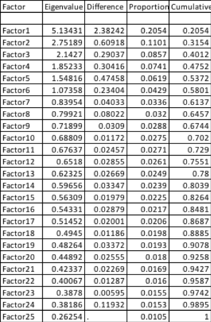
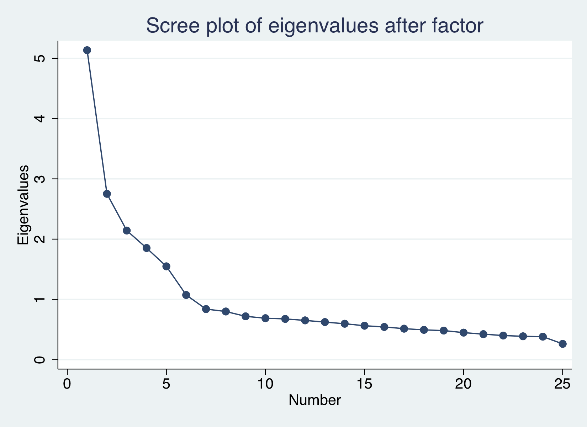
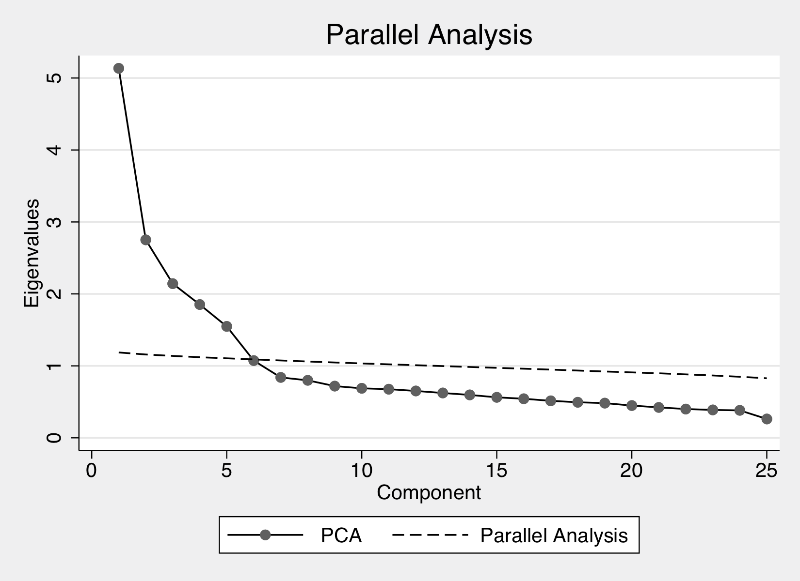
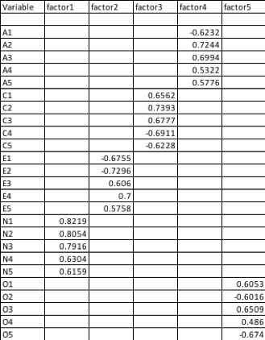
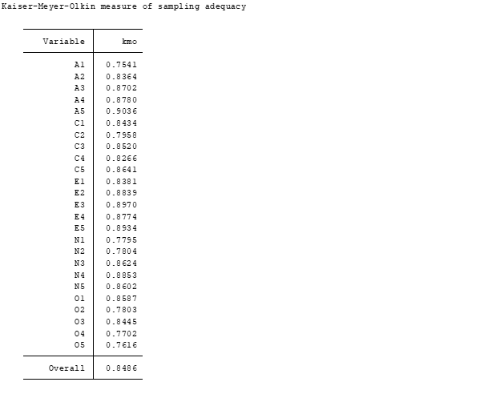

We are using principle components extraction method to do factor analysis for bfi data, which is the 25 personality self reports taken from the International Personality Item Pool. The data is from 2800 subjects, and it also includes additional demographic variables (sex, education and age), but as too many NaNs are included in these variables, we only use the 25 personality items for our analysis
###Principle components extraction
We first apply pcf directly to the 25 columns of our bfi data, then do screeplot and parallel analysis

### Scree Plot to find eigenvalues greater than 1
We have 6 eigenvalues greater than 1, which indicates 6 factors

5 of the observed eigenvalues are greater than the simulated eigenvalues, so we use 5 factors instead
After limiting the facotrs to 5 and rotating factors to faciliate interpretation, we got 5 factors. Factor 1 has N1-N5, Factor2 has E1-E5, Factor 3 has C1-C5, Factor 4 has A1-A5, Factor 5 has O1-O5.

### KMO

The Kaiser-Meyer-Olkin (KMO) measure of sampling adequacy is a better measure of factorability. The KMO tests to see if the partial correlations within your data are close enough to zero to suggest that there is at least one latent factor underlying your variables. 
The KMO value= 0.8486 is greater than 0.5, the minimum acceptable value.

