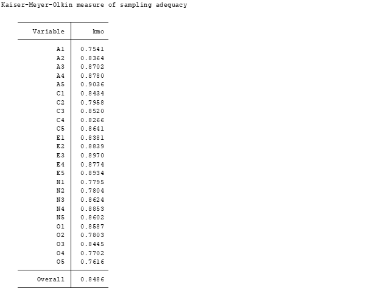

### Load and summarize the data
```{r eval=FALSE}
import delimited bfi.csv,clear
```


Then we summarize the data to see the brief description. We are only interested in the 25 personality self report items, so although the three additional demographic variables (sex, education and age) exist, we do not include them for our analysis. Total observations should be 2800, but some of them are missing as we can see from the table below.
```{r eval=FALSE}
summarize A1-A5 C1-C5 E1-E5 N1-N5 O1-O5 gender education age
```


                         Table1: The summarization table of all 28 variables

### Principle components extraction
We are using principle components extraction method (PCA) to do factor analysis for bfi data.
PCA uses an orthogonal transformation to convert observations of possibly correlated variables into a bunch of values of linearly uncorrelated variables, and those linearly uncorrelated variables are called the principle components. After this transformation, the first principle component has the largest possible variance, and each succeeding variable in turn has the largest variance, and is orthogonal to the preceding component.These principle components are the directions where the data is most spread out.
```{r eval=FALSE}
factor A1-A5 C1-C5 E1-E5 N1-N5 O1-O5,pcf
```


                         
            Table2: Using Principle-component factors, this tables shows the eigenvalues, difference, proportion, and cumulative variance. 

**a**. An eigenvalue is the variance of the factor, the first factor will account for the most variance, the second will account for the next highest variance. 

**b**. Difference gives the differences between the current and following eigenvalues. 

**c**. Proportion of variance accounted for by the factor 

**d**. Cumulative proportion of variance accounted for by this factor

### KMO, Scree Plot, and Parallel Analysis 
The Kaiser-Meyer-Olkin (KMO) measure of sampling adequacy is a better measure of factorability. The KMO tests to see if the partial correlations within your data are close enough to zero to suggest that there is at least one latent factor underlying your variables. 
```{r eval=FALSE}
estat kmo
```


                   Table 3: The KMO value of the 25 variables 
The KMO value= 0.8486 is greater than 0.5, the minimum acceptable value.


A Scree Plot shows the fraction of total variance in the data represented by each PC. We have 6 eigenvalues greater than 1, which indicates 6 factors. Another method to evaluate the scree plot is within a parallel analysis.
```{r eval=FALSE}
scree
```
{width=50%}

                       Picture1:Scree plot of eigenvalues after PCA

```{r eval=FALSE}
search fapara
fapara,pca reps(100)
```

{width=50%}
  
                       Picture2: Parallel Analysis. This suggests that the number of factors= 5 , as 5 factors lie above the simulated (dashed) data line. Thus, I decide to use 5 factors instead

#Rotating and Results
To interpret the extracted factors, we use varimax rotation which attempts to maximize the squared loadings of the columns, and the "blanks" option only displays factor loading greater than a specific value (say 0.45). 
```{r eval=FALSE}
factor A1-A5 C1-C5 E1-E5 N1-N5 O1-O5,pcf factor(5)
rotate, orthogonal varimax blanks(0.45)
```

After limiting the facotrs to 5 and rotating factors to faciliate interpretation, we got the final results: 
**Factor 1** has N1-N5, **Factor 2** has E1-E5, **Factor 3** has C1-C5, **Factor 4** has A1-A5, **Factor 5** has O1-O5.


     
              Table4: The final rotated factor loadings and uniqueness
### Reference
  Revelle, W. (2018) psych: Procedures for Personality and Psychological Research,
  Northwestern University, Evanston, Illinois, USA,
  https://CRAN.R-project.org/package=psych Version = 1.8.10.

  Phil Ender. Statistical Consulting Group.  UCLA:  
  Academic Technology Services. From https://stats.idre.ucla.edu/stat/stata/ado/analysis

