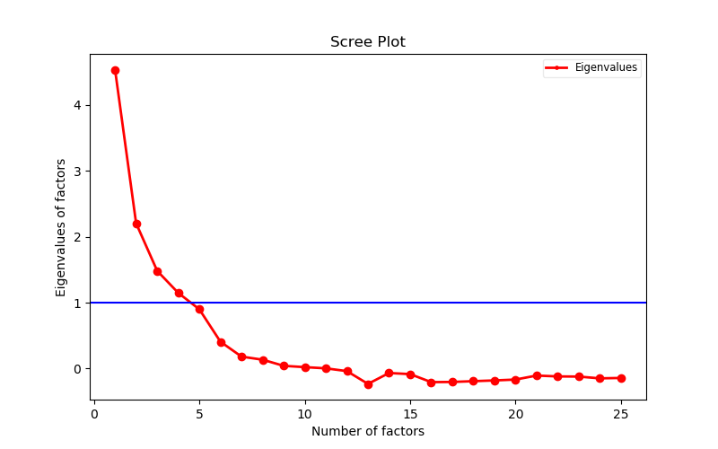

We firstly load the dataset, note that we have selected out the columns we will use and delete the rows containing missing values.
```{python, python.reticulate=FALSE}
import pandas as pd
csv_data = pd.read_csv('mydata.csv')
df = pd.DataFrame(csv_data)
del df['Unnamed: 0']
print(df)
```

Before inplementing factor analysis, the number of factors should be determined. Here we make a Scree plot and choose the number of factors to be the largest number that corresponds to a Eigenvalue larger than 1. 
We calculate the eigenvalues corresponding to factors with the following codes.

```
cor = mat(df.corr())
fill_diagonal(cor, 1-1/cor.I.diagonal()) 
w,_ = np.linalg.eig(cor)
```

Then we make the plot
```
fig = plt.figure(figsize=(8,5))
plt.plot(range(1,len(w)+1), w, 'ro-', linewidth=2)
plt.axhline(y=1, color='b', linestyle='-')
plt.title('Scree Plot')
plt.xlabel('Number of factors')
plt.ylabel('Eigenvalues of factors')
leg = plt.legend(['Eigenvalues'], loc='best', borderpad=0.3, 
                 shadow=False, prop=matplotlib.font_manager.FontProperties(size='small'),
                 markerscale=0.4)
leg.get_frame().set_alpha(0.4)
leg.draggable(state=True)
plt.show()
```


Therefore, we should choose the number of factors to be 4, but the eigenvlue corresponding to factor 5 is really close to 5, so we perform factor analysis for both cases.

```
from factor_analyzer import FactorAnalyzer
fa = FactorAnalyzer()
fa.analyze(df, 4, rotation="varimax")
print(fa.loadings)
```

```{python echo=FALSE, python.reticulate=FALSE}
import pandas as pd
from factor_analyzer import FactorAnalyzer
csv_data = pd.read_csv('mydata.csv')
df = pd.DataFrame(csv_data)
del df['Unnamed: 0']
fa = FactorAnalyzer()
fa.analyze(df, 4, rotation="varimax")
print(fa.loadings)
```


```
from factor_analyzer import FactorAnalyzer
fa = FactorAnalyzer()
fa.analyze(df, 5, rotation="varimax")
print(fa.loadings)
```
```{python echo=FALSE, python.reticulate=FALSE}
import pandas as pd
from factor_analyzer import FactorAnalyzer
csv_data = pd.read_csv('mydata.csv')
df = pd.DataFrame(csv_data)
del df['Unnamed: 0']
fa = FactorAnalyzer()
fa.analyze(df, 5, rotation="varimax")
print(fa.loadings)
```
From the factor loadings, we can see that the results are both good. When the number of factor is chosen to be 5, Factor 1 is mainly composed of E1,E2,E3,E4,E5. Factor 2 is mainly composed of N1,N2,N3,N4,N5. Factor 3 is mainly composed of C1,C2,C3,C4,C5. Factor 4 is mainly composed of O1,O2,O3,O4,O5. Factor 5 is mainly composed of A1,A2,A3,A4,A5. This fits well with the natural of raw column, those columns with the same initial are closely related. If we choose  the number of factor to be 4, factor 1 is composed of both E1,E2,E3,E4,E5 and A1,A2,A3,A4,A5, meaning that it categorize those two groups of columns together and account for them with a single factor. It shows that columns with initial E and columns with initial A are related in some aspects.


